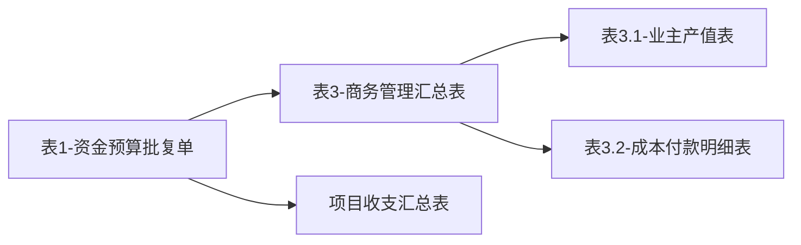

# 020-表1资金预算批复单结构分析

> **版本**：V2.1  
> **创建日期**：2026年6月9日  
> **适用范围**：潘达工程-商务成本智能决策体系  
> **前置成果**：《企业特有规则清单》（V2.0）、《表1字段映射矩阵》（V2.1）  
> **分析定位**：本报告为 Step 2 产出——**企业业务专识萃取**之业务语义与本体对象映射部分，分析表1资金预算批复单的结构与业务逻辑。

---

## 一、报表基本信息

| 属性 | 值 |
|-----|---|
| 报表名称 | 项目月度资金预算批复单 |
| 表编号 | 表1 |
| Excel Sheet名 | `项目月度资金预算批复单-表1` |
| 工作区维度 | A1:F26 |
| 数据来源 | 主要引用表3数据，部分引用项目收支汇总表 |
| 填写状态 | 部分填写（公式自动计算） |
| **核心企业规则** | ER001（产值双轨制）、ER004（资金月度批复）、ER006（收款率计算） |
| **行业通识关联** | E001(项目)、E004(合同)、E005(成本)、E006(产值)、E007(指标) |
| **数据来源类型** | 企业业务素材 |
| **来源说明** | Excel台账：潘达建工（房建）商务成本报表模板.xlsx → 表1资金预算批复单 |

## 二、报表整体结构

表1分为**三大板块**：

```
┌────────────────────────────────────────────────────┐
│ 表头：项目名称、报告期间、单位                        │
├────────────────────────────────────────────────────┤
│ 一、资金情况（行4-13）                              │
│   - 收入类：总收入、业主收入、往来收入               │
│   - 支出类：总支出、成本支出、往来支出               │
│   - 垫资类：公司垫资本金、垫资利息                   │
│   - 资金流：期初资金流、期末资金流                   │
│   - 计划类：收款计划、支出计划、批准支出             │
├────────────────────────────────────────────────────┤
│ 二、项目利润状况（行14-16）                         │
│   - 已确认：业主产值、全口径成本、利润额             │
│   - 已确+待确：业主产值、全口径成本、利润额          │
├────────────────────────────────────────────────────┤
│ 三、项目各指标分析（行17-26）                       │
│   - 7项核心指标：确权比、回款率、成本比等            │
│   - 红绿灯预警机制                                  │
└────────────────────────────────────────────────────┘
```

## 三、单元格详细结构

### 3.1 表头区域（行1-3）

| 单元格 | 内容 | 公式/数据来源 | 业务含义 |
|-------|------|--------------|---------|
| A1 | 表1 - 月度资金预算批复单 | 静态文本 | 报表标题 |
| A2 | 项目名称: | 静态文本 | 标签 |
| D2 | 报告期间: | 静态文本 | 标签 |
| F2 | 单位:元 | 静态文本 | 单位说明 |
| A3 | 工程名称 | 静态文本 | 列标题 |
| E3 | 合同额 | 静态文本 | 列标题 |
| **B3** | 工程名称值 | `='项目月度商务管理汇总表-表3'!B7` | 从表3引用工程名称 |
| **F3** | 合同额值 | `='项目月度商务管理汇总表-表3'!S7` | 从表3引用合同额 |

### 3.2 资金情况区域（行4-13）

#### 3.2.1 收入类指标

| 单元格 | 内容 | 公式 | 映射表3位置 | 业务含义 |
|-------|------|------|------------|---------|
| A4 | 一、资金情况 | 静态文本 | - | 分组标题 |
| A5 | 自开工累计总收入 | 静态文本 | - | 行标题 |
| C5 | 其中：业主收入 | 静态文本 | - | 行标题 |
| E5 | 其中：往来收入 | 静态文本 | - | 行标题 |
| **B5** | 总收入值 | `='表3'!BM7` | 表3!BM7 | 自开工累计总收入 |
| **D5** | 业主收入值 | `='表3'!BU7` | 表3!BU7 | 其中业主收入部分 |
| **F5** | 往来收入值 | `='表3'!CC7+'表3'!CG7+'表3'!CH7` | 表3!CC7+CG7+CH7 | 往来收入（多列汇总） |

#### 3.2.2 支出类指标

| 单元格 | 内容 | 公式 | 映射表3位置 | 业务含义 |
|-------|------|------|------------|---------|
| A6 | 自开工累计总支出 | 静态文本 | - | 行标题 |
| C6 | 其中：成本支出 | 静态文本 | - | 行标题 |
| E6 | 其中：往来支出 | 静态文本 | - | 行标题 |
| **B6** | 总支出值 | `='表3'!CI7` | 表3!CI7 | 自开工累计总支出 |
| **D6** | 成本支出值 | `='表3'!CU7` | 表3!CU7 | 其中成本支出部分 |
| **F6** | 往来支出值 | `='表3'!CZ7+'表3'!DD7+'表3'!DE7` | 表3!CZ7+DD7+DE7 | 往来支出（多列汇总） |

#### 3.2.3 垫资类指标

| 单元格 | 内容 | 公式 | 数据来源 | 业务含义 |
|-------|------|------|---------|---------|
| A7 | 公司垫资本金 | 静态文本 | - | 行标题 |
| C7 | 公司垫资利息 | 静态文本 | - | 行标题 |
| **B7** | 垫资本金值 | `=IF(LOOKUP(...)>=0,0,ABS(LOOKUP(...))-D7)` | 项目收支汇总表 | 公司垫资本金（条件计算） |
| **D7** | 垫资利息值 | `=LOOKUP(1,0/(项目收支汇总表!A5:A306="3.3.1"),项目收支汇总表!C5:C306)` | 项目收支汇总表 | 公司垫资利息 |
| F7 | 空 | `=""` | - | 占位 |

#### 3.2.4 资金流指标

| 单元格 | 内容 | 公式 | 映射表3位置 | 业务含义 |
|-------|------|------|------------|---------|
| A8 | 期初资金流（总收入-总支出） | 静态文本 | - | 行标题 |
| C8 | 期初项目经营性资金流 | 静态文本 | - | 行标题 |
| E8 | 期初往来资金余额 | 静态文本 | - | 行标题 |
| **B8** | 期初资金流值 | `='表3'!DF7` | 表3!DF7 | 期初资金流 |
| **D8** | 经营性资金流值 | `='表3'!DG7` | 表3!DG7 | 期初项目经营性资金流 |
| **F8** | 往来资金余额值 | `=F5-F6` | 计算值 | 期初往来资金余额 |

#### 3.2.5 应收应付指标

| 单元格 | 内容 | 公式 | 映射表3位置 | 业务含义 |
|-------|------|------|------------|---------|
| A9 | 应收未收款（合约） | 静态文本 | - | 行标题 |
| C9 | 应付未付款（合约） | 静态文本 | - | 行标题 |
| **B9** | 应收未收款值 | `='表3'!AL7` | 表3!AL7 | 应收未收款 |
| **D9** | 应付未付款值 | `='表3'!AW7` | 表3!AW7 | 应付未付款 |
| F9 | 空 | `=""` | - | 占位 |

#### 3.2.6 计划类指标

| 单元格 | 内容 | 公式 | 映射表3位置 | 业务含义 |
|-------|------|------|------------|---------|
| A10 | 资金收款计划 | 静态文本 | - | 行标题 |
| **B10** | 收款计划值 | `='表3'!DJ7` | 表3!DJ7 | 资金收款计划 |
| **D10** | 业主收入计划 | `='表3'!DH7` | 表3!DH7 | 其中业主收入 |
| **F10** | 往来收入计划 | `='表3'!DI7` | 表3!DI7 | 其中往来收入 |
| A11 | 项目资金支出计划 | 静态文本 | - | 行标题 |
| **B11** | 支出计划值 | `='表3'!DM7` | 表3!DM7 | 项目资金支出计划 |
| **D11** | 成本支出计划 | `='表3'!DK7` | 表3!DK7 | 其中成本支出 |
| **F11** | 往来支出计划 | `='表3'!DL7` | 表3!DL7 | 其中往来支出 |
| A12 | 公司批准资金支出 | 静态文本 | - | 行标题 |
| **B12** | 批准支出值 | `='表3'!DP7` | 表3!DP7 | 公司批准资金支出 |
| **D12** | 批准成本支出 | `='表3'!DN7` | 表3!DN7 | 其中成本支出 |
| **F12** | 批准往来支出 | `='表3'!DO7` | 表3!DO7 | 其中往来支出 |

#### 3.2.7 预计期末资金流

| 单元格 | 内容 | 公式 | 计算逻辑 | 业务含义 |
|-------|------|------|---------|---------|
| A13 | 预计期末资金流 | 静态文本 | - | 行标题 |
| **B13** | 期末资金流值 | `=B8+B10-B12` | 期初+收款计划-批准支出 | 预计期末资金流 |
| **D13** | 经营性资金流值 | `=D8+D10-D12` | 期初+业主收入-成本支出 | 预计期末经营性资金流 |
| **F13** | 往来资金余额值 | `=F8+F10-F12` | 期初+往来收入-往来支出 | 预计期末往来资金余额 |

### 3.3 项目利润状况区域（行14-16）

| 单元格 | 内容 | 公式 | 映射表3位置 | 业务含义 |
|-------|------|------|------------|---------|
| A14 | 二、项目利润状况 | 静态文本 | - | 分组标题 |
| A15 | 业主产值（已确认） | 静态文本 | - | 行标题 |
| C15 | 全口径成本（已确认） | 静态文本 | - | 行标题 |
| E15 | 开累至今利润额（已确） | 静态文本 | - | 行标题 |
| **B15** | 已确产值值 | `='表3'!AE7` | 表3!AE7 | 业主产值（已确认） |
| **D15** | 已确成本值 | `='表3'!AN7` | 表3!AN7 | 全口径成本（已确认） |
| **F15** | 已确利润额 | `='表3'!BD7` | 表3!BD7 | 开累至今利润额（已确） |
| A16 | 业主产值（已确认+待确认） | 静态文本 | - | 行标题 |
| C16 | 全口径成本（已确认+待确认） | 静态文本 | - | 行标题 |
| E16 | 开累至今利润额（已确+待确） | 静态文本 | - | 行标题 |
| **B16** | 已确+待确产值 | `='表3'!AG7` | 表3!AG7 | 业主产值（已确+待确） |
| **D16** | 已确+待确成本 | `='表3'!AP7` | 表3!AP7 | 全口径成本（已确+待确） |
| **F16** | 已确+待确利润额 | `='表3'!BB7` | 表3!BB7 | 开累至今利润额（已确+待确） |

### 3.4 项目各指标分析区域（行17-26）

#### 3.4.1 表头

| 单元格 | 内容 | 业务含义 |
|-------|------|---------|
| A17 | 三、项目各指标分析 | 分组标题 |
| A18 | 指标名称 | 列标题 |
| B18 | 计算规则 | 列标题 |
| C18 | 结果 | 列标题 |
| D18 | 参考值 | 列标题 |
| E18 | 红绿灯 | 列标题 |
| F18 | 存在问题原因分析 | 列标题 |

#### 3.4.2 七项核心指标

| 行号 | 指标编号 | 指标名称 | 计算规则 | 公式来源 | 参考值 |
|-----|---------|---------|---------|---------|-------|
| 20 | [10] | 业主产值确权比 | 已确权产值/总产值 | `='表3'!BF7` | ≥85% |
| 21 | [20] | 确权产值回款率 | 业主已收款/已确权产值 | `='表3'!BG7` | ≥75~80% |
| 22 | [30] | 成本确权比 | 已确权产值/总成本 | `='表3'!BH7` | ≥85% |
| 23 | [40] | 成本刚性度 | 已确权成本/总成本 | `='表3'!BI7` | ≥95% |
| 24 | [50] | 产值现金流入比 | 总收入/总产值 | `='表3'!BJ7` | ≥70% |
| 25 | [60] | 成本资金收入比 | 总收入/总成本 | `='表3'!BK7` | 根据合同约定 |
| 26 | [70] | 成本资金支出比 | 总支出/总成本 | `='表3'!BL7` | 65%~80% |

**指标公式详情**：

| 单元格 | 公式内容 |
|-------|---------|
| A20 | `="[10]业主产值确权比"` |
| B20 | `="已确权产值/总产值"` |
| C20 | `='项目月度商务管理汇总表-表3'!BF7` |
| D20 | `="主要根据合同约定，常规值≥85%"` |
| A21 | `="[20]确权产值回款率"` |
| B21 | `="业主已收款/已确权产值"` |
| C21 | `='项目月度商务管理汇总表-表3'!BG7` |
| D21 | `="主要根据合同约定，常规值≥75~80%"` |
| A22 | `="[30]成本确权比"` |
| B22 | `="已确权产值/总成本"` |
| C22 | `='项目月度商务管理汇总表-表3'!BH7` |
| D22 | `="主要根据合同约定，常规值≥85%"` |
| A23 | `="[40]成本刚性度"` |
| B23 | `="已确权成本/总成本"` |
| C23 | `='项目月度商务管理汇总表-表3'!BI7` |
| D23 | `="≥95%"` |
| A24 | `="[50]产值现金流入比"` |
| B24 | `="总收入/总产值"` |
| C24 | `='项目月度商务管理汇总表-表3'!BJ7` |
| D24 | `="≥70%"` |
| A25 | `="[60]成本资金收入比"` |
| B25 | `="总收入/总成本"` |
| C25 | `='项目月度商务管理汇总表-表3'!BK7` |
| D25 | `="主要根据合同约定判断"` |
| A26 | `="[70]成本资金支出比"` |
| B26 | `="总支出/总成本"` |
| C26 | `='项目月度商务管理汇总表-表3'!BL7` |
| D26 | `="65%~80%"` |

## 四、数据依赖关系

### 4.1 表间引用关系



### 4.2 引用统计

| 数据来源 | 引用次数 | 占比 |
|---------|---------|-----|
| 表3-商务管理汇总表 | 32次 | 91% |
| 项目收支汇总表 | 2次 | 6% |
| 本表计算 | 3次 | 3% |

### 4.3 表3列号映射表

表1主要引用表3第7行的各列数据，以下是列号对应关系：

| 表3列号 | Excel列 | 表1引用位置 | 业务含义 |
|--------|--------|------------|---------|
| 2 | B | B3 | 工程名称 |
| 19 | S | F3 | 合同额 |
| 40 | AL | B9 | 应收未收款 |
| 49 | AW | D9 | 应付未付款 |
| 31 | AE | B15 | 业主产值（已确认） |
| 40 | AN | D15 | 全口径成本（已确认） |
| 33 | AG | B16 | 业主产值（已确+待确） |
| 42 | AP | D16 | 全口径成本（已确+待确） |
| 54 | BB | F16 | 利润额（已确+待确） |
| 56 | BD | F15 | 利润额（已确认） |
| 58 | BF | C20 | 指标[10]业主产值确权比 |
| 59 | BG | C21 | 指标[20]确权产值回款率 |
| 60 | BH | C22 | 指标[30]成本确权比 |
| 61 | BI | C23 | 指标[40]成本刚性度 |
| 62 | BJ | C24 | 指标[50]产值现金流入比 |
| 63 | BK | C25 | 指标[60]成本资金收入比 |
| 64 | BL | C26 | 指标[70]成本资金支出比 |
| 66 | BM | B5 | 自开工累计总收入 |
| 73 | BU | D5 | 其中业主收入 |
| 81 | CC | F5(部分) | 往来收入1 |
| 85 | CG | F5(部分) | 往来收入2 |
| 86 | CH | F5(部分) | 往来收入3 |
| 87 | CI | B6 | 自开工累计总支出 |
| 99 | CU | D6 | 其中成本支出 |
| 104 | CZ | F6(部分) | 往来支出1 |
| 108 | DD | F6(部分) | 往来支出2 |
| 109 | DE | F6(部分) | 往来支出3 |
| 114 | DF | B8 | 期初资金流 |
| 115 | DG | D8 | 期初经营性资金流 |
| 116 | DH | D10 | 业主收入计划 |
| 117 | DI | F10 | 往来收入计划 |
| 118 | DJ | B10 | 资金收款计划 |
| 119 | DK | D11 | 成本支出计划 |
| 120 | DL | F11 | 往来支出计划 |
| 121 | DM | B11 | 项目资金支出计划 |
| 122 | DN | D12 | 批准成本支出 |
| 123 | DO | F12 | 批准往来支出 |
| 124 | DP | B12 | 公司批准资金支出 |

## 五、业务逻辑分析

### 5.1 核心业务逻辑

1. **资金流计算逻辑**
   - 期初资金流 = 总收入 - 总支出
   - 预计期末资金流 = 期初资金流 + 收款计划 - 批准支出

2. **利润计算逻辑**
   - 利润额 = 业主产值 - 全口径成本
   - 分两种口径：已确认、已确认+待确认

3. **指标计算逻辑**
   - 所有指标值均来自表3的计算结果
   - 表1仅做展示，不参与计算

### 5.2 预警机制

根据编制说明，红绿灯预警规则：
- **红色预警**：7项指标中≥6项超出参考范围，或总利润率连续≥3个月为负
- **黄色预警**：7项指标中2-5项超出参考范围，或总利润率连续≥2个月为负
- **绿色**：指标正常且利润率为正

## 六、待确认问题

| 序号 | 问题描述 | 影响范围 | 建议确认方式 |
|-----|---------|---------|------------|
| 1 | 表3各列的具体业务含义需进一步确认 | 所有引用字段 | 查阅表3结构或咨询业务专家 |
| 2 | 项目收支汇总表的数据结构未提供 | B7、D7字段 | 获取该表结构文档 |
| 3 | 往来收入/支出的三列汇总逻辑含义 | F5、F6字段 | 确认三列分别代表什么 |
| 4 | 红绿灯的具体判断逻辑（阈值） | 指标分析区域 | 确认各指标的预警阈值设置 |

---

**文档版本**：v1.0  
**创建日期**：2026年6月5日  
**分析对象**：表1-项目月度资金预算批复单