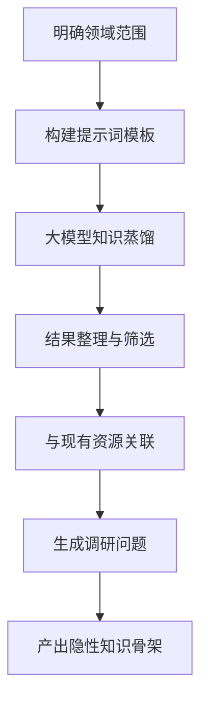
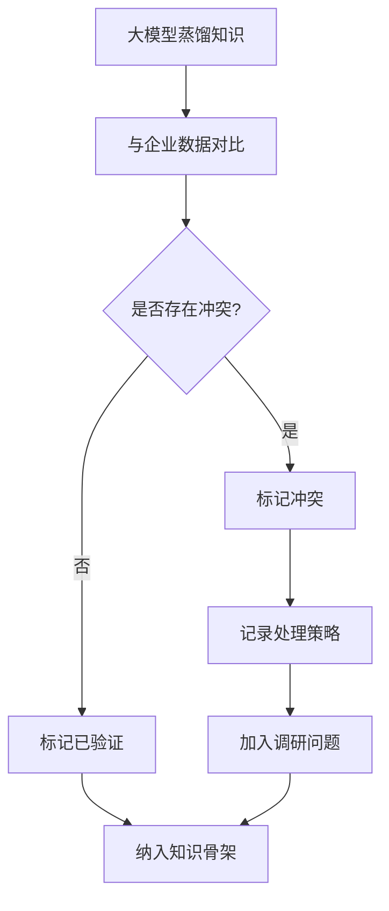
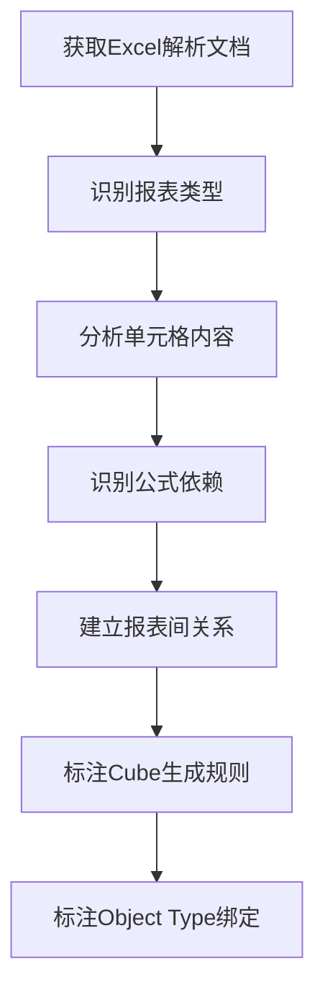
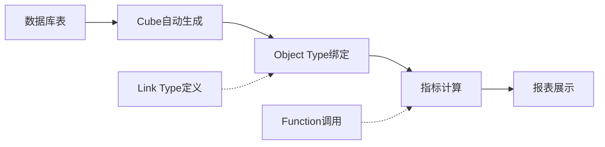

# 本体蒸馏萃取与设计方法论（商务成本项目定制版）

> **版本**：V6.0  
> **更新日期**：2026年6月9日  
> **适用范围**：潘达工程-商务成本智能决策体系  
> **依据规范**：《本体规划指南》《本体命名规范》《本体分类规划与SDK扩展方案》  
> **核心原则**：规划与实施分离，规划文档仅负责设计，实施由架构师标准方法执行

---

## 一、规划分层体系说明

### 1.0 分层结构

```
┌─────────────────────────────────────────────────────────────┐
│  000-顶层设计.md           │ 极简版，核心步骤（12步）       │
├─────────────────────────────────────────────────────────────┤
│  010-项目总体规划.md       │ 详细版，阶段目标和任务分解      │
├─────────────────────────────────────────────────────────────┤
│  900-方法论体系/000-核心纲领 │ 核心文件集合，定义原则和方法论    │
└─────────────────────────────────────────────────────────────┘
```

### 1.1 规划与实施分离原则

> **核心原则**：本规划文档仅负责**设计层面**的规划，**具体技术实施**（本体建模、数据流程开发等）必须使用架构师提供的标准方法执行。架构师的方法具有最高优先级和权威性。

```
规划阶段（本文档）           实施阶段（架构师方法）
──────────────────           ────────────────────
│ 业务域定义       │  →  │  SDK脚本生成        │
│ 物理表设计       │     │  脚本发布验证        │
│ Cube层设计       │     │  数据接入           │
│ 本体对象定义     │     │  Flow流程开发       │
│ 链接关系定义     │     │  应用开发           │
└──────────────────┘     └───────────────────┘
```

### 1.2 核心步骤（顶层设计）

> **阶段划分**：6个阶段+阶段零，12个步骤

| 阶段 | 步骤 | 名称 | 核心任务 | 关键产出 |
|------|------|------|---------|---------|
| **阶段零** | 1 | 数据空间挂接 | 确认或创建数据空间，项目挂接绑定 | 项目与数据空间绑定确认 |
| **阶段零** | 2 | 平台架构理解 | 理解平台能力、研读规范文档 | 平台能力理解报告 |
| **阶段一** | Step 1 | 行业及企业业务通识蒸馏 | **核心基础**：大模型蒸馏行业知识（五层次），形成完整的行业知识体系，其重要性超过企业专识萃取 | 行业知识骨架文档（包含完整的五层次知识体系） |
| **阶段一** | Step 2 | 企业业务专识萃取 | 从Excel台账和数据库表萃取企业规则 | 企业业务知识萃取报告 |
| **阶段一** | Step 3 | 业务语义与本体对象映射 | 建立业务分析视角与本体对象设计的桥梁（输入：Step1+Step2+Excel/DB分析） | 业务语义与本体对象映射文档 |

---

## 一、数据来源标记体系规范

> **核心原则**：所有业务知识和规则必须标记来源，确保可追溯性和可信度。采用**轻量级标记体系**，避免过度复杂。

### 1.0 标记维度定义

| 标记项 | 说明 | 取值范围 |
|-------|------|---------|
| **来源类型** | 标记知识的可信度层级 | `企业业务素材` / `行业通用知识` |
| **来源说明** | 具体来源细节，根据来源类型区分详细程度 | 文本描述 |

### 1.1 不同场景的标记方法

#### 场景1：行业通识蒸馏（Step 1）
- **来源类型**：`行业通用知识`
- **来源说明**：只需标记"大模型蒸馏：[行业名称]"，无需详细说明
- **示例**：`行业通用知识（大模型蒸馏：建筑行业）`

**五层次蒸馏框架说明**：
行业通识蒸馏采用五层次框架：
- **L1**：基础业务知识（概念、流程、术语）
- **L2**：显性业务关系（实体关联、数据流向）
- **L3**：隐性业务关系（经验常识、关联规则）
- **L4**：行业独特诀窍（特有规则、门道）
- **L5**：行业通用流程规则（标准化流程、审批规则）

#### 场景2：Excel台账萃取（Step 2）
- **来源类型**：`企业业务素材`
- **来源说明**：需包含以下信息：Excel文件名 → 报表名称 → 具体位置/公式
- **示例**：`企业业务素材（Excel台账：潘达建工（房建）商务成本报表模板.xlsx → 表3.1-业主产值详表 → 公式分析）`

#### 场景3：数据库表萃取（Step 2）
- **来源类型**：`企业业务素材`
- **来源说明**：需包含以下信息：数据库名称 → 表名 → 字段/结构分析
- **示例**：`企业业务素材（数据库：建工成本01（DuckDB）→ tb_project_indicator表 → 结构分析）`

#### 场景4：业务语义与本体映射（Step 3）
- **来源类型**：混合（`企业业务素材`或`行业通用知识`）
- **来源说明**：标记映射关系的具体来源
- **示例**：`来源：Excel台账表3.1字段映射` 或 `来源：行业通用知识`

#### 场景5：本体设计与建模
- **来源类型**：混合（`企业业务素材`或`行业通用知识`）
- **来源说明**：标记每个属性/关系的来源规则
- **示例**：`来源：企业特有规则ER001` 或 `来源：行业通用知识`

### 1.2 标记实施规范

#### 表格标记规范
在所有分析表格中新增两列：

| 新增列名 | 说明 |
|---------|------|
| **来源类型** | 标记知识可信度层级 |
| **来源说明** | 具体来源细节 |

#### 文档标记规范
在所有分析文档中，对每个规则、指标、关系都必须添加来源标记：
- **格式**：`【来源类型】来源说明`
- **示例**：`【企业业务素材】Excel台账表3.1公式分析`

#### 冲突解决原则
1. **企业业务素材优先**：当企业业务素材与行业通用知识冲突时，以企业业务素材为准
2. **最新数据优先**：当不同来源的企业业务素材冲突时，以最新数据为准
3. **业务确认优先**：当数据存在歧义时，需与业务人员确认

---
| **阶段二** | **Step 4** | **本体物理表模型设计** | **设计符合平台规范的物理表/Cube/关系** | **本体数据架构设计文档** |
| **阶段二** | Step 5 | 本体设计确认 | Object/Link/Action定义确认 | 本体设计确认文档 |
| **阶段三** | **Step 6** | **本体建模落地** | **调用架构师方法完成本体建模** | **本体建模落地完成确认** |
| **阶段三** | Step 7 | 本体脚本发布与验证 | SDK脚本发布、分类挂载 | 本体发布验证报告 |
| **阶段四** | **Step 8** | **数据源映射与建设** | **建立本体表到现实数据源的映射** | **数据源映射分析报告** |
| **阶段四** | Step 9 | 数据接入与对接 | ETL、Excel导入、Flow流程开发 | 数据源接入报告、数据对接报告 |
| **阶段四** | Step 10 | 模拟数据规划（可选） | 模拟数据规则和勾稽关系设计 | 模拟数据计划 |
| **阶段五** | **Step 11** | **业务应用与分析能力开发** | **基础查询、复杂分析、Action开发** | **业务应用与分析能力** |
| **阶段六** | **Step 12** | **本体优化迭代** | **调用架构师方法完成本体优化** | **本体优化迭代报告** |

---

## 二、核心策略：相对理想型

### 2.1 策略定义

**这是本项目的核心指导思想**，必须贯穿所有阶段：

| 维度 | 说明 |
|------|------|
| **理想化** | 本体架构和数据架构应该支撑企业商务成本分析的**完整、科学、面向未来**的状态 |
| **相对** | 理想架构必须基于**现实可获得的数据源**，不能脱离实际 |
| **平衡** | 在理想设计与现实约束之间寻求平衡 |

### 2.2 三层架构的来源关系

```
┌──────────────────────────────────────────────────────────────────────┐
│                         本体层（Ontology）                            │
│  Object Type、Link Type、Action Type                                │
│  ← 基于理想业务模型设计                                              │
├──────────────────────────────────────────────────────────────────────┤
│                      Cube层（平台自动生成）                           │
│  维度、度量、聚合                                                    │
│  ← 基于**实际存在的物理表**自动生成                                  │
├──────────────────────────────────────────────────────────────────────┤
│                        物理层（Table）                               │
│  ┌─────────────────┐    ┌─────────────────┐                        │
│  │  【理想表】      │    │  【实际存在的表】│                        │
│  │  业务需求设计   │    │  现有数据库表    │                        │
│  └────────┬────────┘    └────────┬────────┘                        │
│           └──────────┬───────────┘                                  │
│                      ↓                                              │
│              【数据源映射分析】← 核心！必须明确！                      │
└──────────────────────────────────────────────────────────────────────┘
```

### 2.3 关键原则

- **先设计理想，再找现实**：先明确"应该有什么数据"，再分析"有什么数据可用"
- **差距分析是核心**：`理想表` 与 `现实表` 之间的差距，必须有明确的填补方案
- **数据来源必须可追溯**：每个本体属性必须能追溯到具体的数据源

### 2.4 方法优化：预研机制

> **优化说明**：为平衡理想设计与现实落地，增加**预研机制**作为相对理想型策略的补充

**预研机制核心内容**：
1. **预研时机**：在阶段二本体设计期间，可同步启动数据源预研
2. **预研内容**：数据源盘点、差距分析、可行性评估
3. **预研成果**：作为参考资料，不影响理想设计的科学性
4. **预研价值**：提前识别风险，缩短后续落地周期

**预研约束**：
- 预研成果不得作为本体设计的直接依据
- 理想设计必须保持独立性和科学性
- 预研仅作为落地风险的预判和准备

**预研实施指南**：
1. **阶段二**：在完成理想本体设计的同时，并行开展数据源预研
2. **阶段三**：基于理想schema完成本体建模，无需考虑数据源
3. **阶段四**：以预研成果为基础，完善为正式的数据源映射分析报告

### 2.5 预研机制详细规范

#### 2.5.1 预研定位

| 维度 | 说明 |
|------|------|
| **文档性质** | 预研成果，非阶段正式交付物 |
| **存放位置** | 阶段二目录下 |
| **核心策略** | 相对理想型 - 提前预判数据约束，降低落地风险 |

#### 2.5.2 预研内容

1. **现有数据源盘点**：确认现有数据库中实际存在哪些表
2. **理想表与现实映射**：建立理想表与现实数据源的映射关系
3. **差距分析**：明确"理想"与"现实"之间的差距
4. **填补方案**：针对差距制定具体填补方案

#### 2.5.3 预研产出规范

| 项目 | 规范 |
|------|------|
| **文件夹** | `200-阶段二-xxx\160-数据源映射分析（预研）\` |
| **文件名** | `010-数据源映射分析报告（预研版）.md` |
| **文档头部** | 必须标注"文档性质：预研成果，非阶段正式交付物" |

#### 2.5.4 预研约束

✅ **推荐使用场景**：
1. 阶段二本体设计参考（不影响理想设计的前提下）
2. 阶段四数据接入准备（作为正式分析的基础）
3. 项目风险评估（提前识别数据缺口）

❌ **禁止使用场景**：
1. 阶段二本体设计约束（不得限制理想本体设计的科学性）
2. 阶段三建模依据（必须基于理想schema）
3. 正式交付物（需在阶段四重新整理为正式版本）

---

## 二、方法论概述

### 1.1 本项目方法论特点

**通用本体设计方法论 vs 本项目定制方法论**：

| 维度 | 通用方法论 | 本项目定制方法论 |
|------|-----------|----------------|
| **目标** | 映射分析 | 转换规则+本体绑定 |
| **输出** | 映射矩阵 | 平台可理解的分析产物 |
| **导向** | 数据驱动 | 本体导向 |
| **验证** | 数据验证 | 本体一致性验证 |

### 1.2 核心方法论原则

| 原则 | 说明 | 在本项目中的应用 |
|------|------|----------------|
| **以转换为导向** | 分析结果应转化为平台可理解的转换规则 | 字段映射需明确Cube生成规则 |
| **以本体绑定为目标** | 每个字段应明确其对应的Object Type属性 | 映射矩阵需包含bind_source标注 |
| **以指标计算为基础** | 指标规则应可直接用于派生属性定义 | 指标需分层（L1-L4）并明确计算依赖 |
| **以血缘追溯为辅助** | 明确数据从源到展示的完整流向 | 血缘图用于Link Type设计 |

### 1.3 分析目标层次

```
阶段一目标：
┌─────────────────────────────────────────────────────┐
│ Excel报表 → 映射矩阵 → 转换规则 → Cube自动生成      │
│ 数据库表 → 字段分析 → bind_source → Object Type    │
│ 指标公式 → 分层定义 → 派生属性 → Function逻辑      │
│ 数据血缘 → 关系标注 → 语义定义 → Link Type         │
└─────────────────────────────────────────────────────┘

阶段二目标：
┌─────────────────────────────────────────────────────┐
│ 转换规则 → 平台确认Cube → 补充定义（如需）         │
│ 映射矩阵 → 定义Object Type → 绑定属性             │
│ 指标分层 → 定义派生属性 → 注册本体                 │
│ 血缘语义 → 定义Link Type → 构建本体网络           │
└─────────────────────────────────────────────────────┘
```

---

## 二、行业与企业业务知识研究方法

> **核心策略**：行业通识蒸馏是整个项目的**基础和骨架**，具有提纲挈领的作用，其重要性超过企业专识萃取。通过大模型蒸馏形成完整的行业知识体系，为后续所有工作提供统一的语言、框架和方向。

> **引用**：知识蒸馏框架遵循《000-顶层设计.md》中定义的**五层次知识蒸馏框架**（L1-L5）。本章节提供各层次的具体操作指南和输出模板。

### 2.1 基础业务知识蒸馏（L1）

**定义**：行业通用的业务概念、流程、术语，是理解业务的基础。

**蒸馏步骤**：
1. 明确领域范围：房建行业、商务成本管理
2. 提取核心概念：项目、产值、成本、利润、资金等
3. 梳理业务流程：项目立项→施工→结算→决算
4. 整理术语表：确认产值、待确产值、刚性成本等

**产出示例**：
```yaml
基础业务知识:
  核心概念:
    - 概念: 项目
      定义: 具有独立立项编号的建筑工程
      属性: [项目名称, 项目编号, 项目类型, 开工日期, 竣工日期]
    - 概念: 产值
      定义: 已完成的工程量对应的金额
      分类: [确认产值, 待确产值]
    - 概念: 成本
      定义: 项目实施过程中发生的各项费用
      分类: [人工费, 材料费, 机械费, 管理费, ...]
  
  业务流程:
    - 流程: 项目生命周期
      阶段: [立项 → 施工 → 结算 → 决算]
    - 流程: 成本管理流程
      阶段: [预算 → 控制 → 核算 → 分析]
```

### 2.2 显性业务关系蒸馏

**定义**：文档、数据库中明确记录的业务实体关联、数据流向和业务流程，是本体设计的基础。

**显性关系的常见类型**：
- 实体包含关系：项目包含合同、合同包含合同项
- 数据流向关系：发票→成本核算→成本汇总
- 业务流程关系：申请→审批→执行→归档
- 属性关联关系：合同金额→已支付金额→未支付金额

**蒸馏步骤**：
1. 梳理数据库表结构，识别主外键关系
2. 分析Excel报表的表头和数据组织方式
3. 绘制业务实体关系图（ER图）
4. 定义实体间的基数关系（1:1、1:N、M:N）

**产出示例**：
```yaml
显性关系列表:
  - 关系ID: E001
    关系类型: 包含
    源实体: 项目
    目标实体: 成本
    基数: 1:N
    说明: 一个项目包含多个成本项
  
  - 关系ID: E002
    关系类型: 包含
    源实体: 成本
    目标实体: 合同项
    基数: 1:N
    说明: 一个成本项可包含多个合同项
  
  - 关系ID: E003
    关系类型: 归属
    源实体: 合同项
    目标实体: 供应商
    基数: N:1
    说明: 合同项归属于某个供应商
  
  - 关系ID: E004
    关系类型: 流向
    源实体: 发票
    目标实体: 付款申请
    基数: 1:N
    说明: 发票可发起多次付款申请
```

### 2.3 隐性业务关系蒸馏（重点）

**定义**：未在文档、数据库中显式记录，但在业务决策中起到关键作用的业务关系和经验常识。

**隐性知识的常见类型**：
- 业务规则的隐含假设
- 指标间的隐性关联
- 异常情况的处理惯例
- 决策时的经验判断

**蒸馏步骤**：


**提示词模板示例**：
```
作为房建行业商务成本专家，请列举项目成本管理中的典型业务关系：

1. 成本超支与哪些因素相关？
2. 利润率下降的常见原因有哪些？
3. 项目阶段与成本支出的关系是什么？
4. 哪些指标之间存在隐性关联？
5. 成本确认过程中有哪些经验规则？
```

**产出示例**：
```yaml
隐性关系列表:
  - 关系ID: R001
    关系名称: 成本超支与设计变更的关联
    关系描述: 设计变更通常会导致成本超支，尤其是结构设计变更
    关联对象: [ProjectCost, DesignChange]
    关联报表: [表2-项目月度商务管理分析表]
    关联字段: [成本偏差率, 设计变更次数]
    业务含义: 设计变更次数超过3次时，成本超支风险显著增加
    调研优先级: 高
    
  - 关系ID: R002
    关系名称: 利润率与收款周期的隐性关系
    关系描述: 收款周期超过60天会影响项目利润率
    关联对象: [Project, PaymentSchedule]
    关联报表: [表3-项目月度商务管理汇总表]
    关联字段: [利润率, 平均收款周期]
    业务含义: 收款周期每延长10天，利润率下降约0.5%
    调研优先级: 高
```

### 2.4 行业独特诀窍蒸馏（L4，重点）

**定义**：行业特有的规则、门道，在其他行业不存在或形式不同。

**房建行业独特诀窍示例**：

| 诀窍ID | 诀窍名称 | 诀窍描述 | 业务影响 |
|--------|---------|---------|---------|
| T001 | 产值确认规则 | 产值需业主签字才认可 | 影响产值确认流程和收款 |
| T002 | 农民工工资专户 | 农民工工资必须通过专户发放 | 影响成本支付流程 |
| T003 | 进度款支付比例 | 进度款支付通常按合同约定的比例（如80%） | 影响资金流预测 |
| T004 | 保修金预留 | 通常预留3-5%作为保修金 | 影响最终收款 |
| T005 | 变更签证规则 | 设计变更必须办理签证才能计入成本 | 影响成本确认 |
| T006 | 材料价格波动 | 主要材料价格波动超过5%可调价 | 影响成本控制 |

**蒸馏步骤**：
1. 识别行业特有规则：通过大模型识别房建行业特有的业务规则
2. 与其他行业对比：确认这些规则在其他行业不存在或形式不同
3. 分析业务影响：分析每个诀窍对业务的影响
4. 与企业实际关联：确认企业是否遵循这些规则

**产出示例**：
```yaml
行业独特诀窍:
  - 诀窍ID: T001
    诀窍名称: 产值确认规则
    诀窍描述: 产值需业主签字才认可，否则只能作为待确产值
    适用场景: 房建行业特有，其他行业不适用
    业务影响: 
      - 影响产值确认流程
      - 影响收款时间
      - 影响利润计算
    关联报表: [表3.1-业主产值详表, 表3.1.1-业主待确产值详表]
    关联字段: [确认产值, 待确产值]
    调研优先级: 高
    
  - 诀窍ID: T002
    诀窍名称: 农民工工资专户管理
    诀窍描述: 农民工工资必须通过银行专户发放，不能直接支付
    适用场景: 建筑行业特有，政策要求
    业务影响:
      - 影响成本支付流程
      - 影响资金计划
      - 需要专户管理
    关联报表: [表3.2-月度成本资金详表]
    调研优先级: 高
```

### 2.4 行业通用流程规则蒸馏（L5）

**定义**：行业通用的业务流程和审批规则，是业务执行的标准化流程。

**房建行业通用流程规则示例**：

| 规则ID | 规则名称 | 规则描述 | 行业通用性 |
|--------|---------|---------|---------|
| PR001 | 产值确认流程 | 产值确认需经过项目申报→监理审核→业主确认 | 通用 |
| PR002 | 成本报销流程 | 成本报销需经过项目审核→公司审批 | 通用 |
| PR003 | 合同审批流程 | 合同签订需经过商务谈判→法务审核→领导审批→签订盖章 | 通用 |
| PR004 | 资金支付流程 | 资金支付需经过申请提交→审核确认→领导审批→财务支付 | 通用 |

**蒸馏步骤**：
1. 识别行业通用流程：通过大模型识别房建行业通用的业务流程和审批规则
2. 分析流程节点：拆解每个流程的关键节点和责任人
3. 确认行业通用性：确认这些流程在行业内的通用性
4. 与企业实际对比：识别企业流程与行业通用流程的差异

**产出示例**：
```yaml
行业通用流程规则:
  - 规则ID: PR001
    规则名称: 产值确认流程
    规则描述: 产值确认需经过项目申报→监理审核→业主确认
    流程节点:
      - 节点1: 项目申报
        责任人: 项目商务人员
        说明: 提交产值申报资料
      - 节点2: 监理审核
        责任人: 监理单位
        说明: 审核工程量真实性
      - 节点3: 业主确认
        责任人: 业主单位
        说明: 签字确认产值金额
    行业通用性: 通用
    适用场景: 进度款申报、结算款申报等
  
  - 规则ID: PR002
    规则名称: 成本报销流程
    规则描述: 成本报销需经过项目审核→公司审批
    流程节点:
      - 节点1: 项目审核
        责任人: 项目经理/成本会计
        说明: 审核成本合理性
      - 节点2: 公司审批
        责任人: 公司财务/商务部门
        说明: 审批报销申请
    行业通用性: 通用
    适用场景: 人工费、材料费、机械费等成本报销
```

### 2.5 交叉验证与冲突处理

**核心原则**：所有蒸馏的知识都必须和企业实际数据交叉验证，以企业自身情况为准。

**验证流程**：


**冲突处理优先级**：

| 优先级 | 来源 | 说明 |
|-------|------|------|
| 1 | 企业数据库表 | **最高优先级**，以实际数据为准 |
| 2 | Excel台账公式 | 业务规则的权威来源 |
| 3 | 企业业务文档 | 补充说明 |
| 4 | 大模型蒸馏知识 | 仅作为参考，**需验证** |

**冲突记录模板**：
```yaml
冲突ID: C001
冲突类型: 规则冲突
来源1: 大模型蒸馏（行业诀窍T001）
来源2: 表3.1公式
冲突描述: 大模型认为"产值需业主签字才认可"，但表3.1中存在"按进度确认产值"的计算方式
处理策略: 以表3.1为准，调研确认企业实际的产值确认规则
原因分析: 企业可能采用多种产值确认方式
状态: 待调研验证
```

### 2.6 产出物清单

| 产出物 | 格式 | 内容 |
|--------|------|------|
| 行业知识骨架文档 | MD/YAML | 五层次知识：基础业务知识、显性业务关系、隐性业务关系、行业独特诀窍、行业通用流程规则 |
| 调研问题模板 | MD | 基于五类知识设计的调研提纲 |
| 冲突记录清单 | MD/YAML | 大模型知识与企业数据的冲突记录 |
| 优先级排序表 | CSV/MD | 按重要性排序的知识项清单 |

---

## 三、企业业务知识萃取方法（核心！）

### 3.1 定位与意义

**这是企业个性化知识的核心来源**，从Excel台账和现有数据库表中萃取业务知识，遵循与行业通识蒸馏相同的**五层次框架**，但聚焦于企业特有的业务规则和决策模式。

> **引用**：《000-顶层设计.md》，五层次知识蒸馏框架（核心定义）。

| 维度 | 说明 |
|------|------|
| **前置条件** | 已完成阶段一（行业与企业业务知识研究） |
| **核心任务** | 从Excel台账和数据库表中萃取企业个性化业务知识（遵循五层次框架） |
| **产出价值** | 为本体设计提供企业特有的业务知识（比通用知识更有价值） |

### 3.2 五层次企业业务专识萃取框架

**核心思想**：企业业务专识萃取与行业通识蒸馏遵循相同的五层次框架，但内容聚焦于企业特有的业务规则和决策模式。

| 层次 | 名称 | 萃取方法 | 产出示例 |
|------|------|----------|----------|
| **L1** | 基础业务知识 | 从Excel台账和数据库表中提取企业特有的业务概念、术语、分类规则 | 企业术语表、业务实体清单 |
| **L2** | 显性业务关系 | 从数据库表结构和业务系统中提取企业明确的实体关联、数据流向 | 企业实体关系图、表间关系清单 |
| **L3** | 隐性业务关系 | 从Excel报表公式和业务人员访谈中提取企业决策时的经验常识 | 企业隐性关系清单、指标关联矩阵 |
| **L4** | 企业独特诀窍 | 从Excel台账和业务系统配置中提取企业独有的业务规则、操作流程 | 企业独特规则清单、业务流程手册 |
| **L5** | 企业通用流程规则 | 从业务系统和管理制度中提取企业内部通用的业务流程和审批规则 | 企业流程规则清单、审批流程图 |

### 3.3 具体萃取步骤

```
┌─────────────────────────────────────────────────────────────────┐
│                     企业业务知识萃取框架                          │
├─────────────────────────────────────────────────────────────────┤
│                                                                 │
│   ┌───────────────┐     ┌───────────────┐                      │
│   │   Excel台账   │     │  数据库表     │                      │
│   │  (业务规则)   │     │  (实体模型)   │                      │
│   └───────┬───────┘     └───────┬───────┘                      │
│           │                     │                              │
│           └─────────┬───────────┘                              │
│                     ↓                                          │
│           ┌───────────────────┐                                │
│           │   知识萃取        │                                │
│           │  (解析/提炼/整合) │                                │
│           └─────────┬─────────┘                                │
│                     ↓                                          │
│   ┌───────────────┬───────────────┬───────────────┐            │
│   │ 业务决策逻辑 │  业务实体模型  │  企业特有规则  │            │
│   └───────────────┴───────────────┴───────────────┘            │
│                     ↓                                          │
│           企业业务知识体系                                      │
│                     ↓                                          │
│           本体设计依据                                          │
└─────────────────────────────────────────────────────────────────┘
```

### 3.4 Excel业务规则萃取

**任务**：分析Excel报表结构背后的业务决策逻辑和指标计算规则

**萃取步骤**：

| 步骤 | 任务 | 方法 | 产出 |
|------|------|------|------|
| 1 | 解析报表结构 | 分析报表的行、列、单元格布局 | 报表结构树 |
| 2 | 提取计算公式 | 解析单元格公式，理解计算逻辑 | 公式解析文档 |
| 3 | 识别业务规则 | 分析公式背后的业务含义 | 业务规则清单 |
| 4 | 梳理报表关系 | 分析报表间的引用关系 | 报表依赖图 |
| 5 | 识别分类体系 | 识别报表中的分类维度和层级 | 分类维度清单 |

**公式解析示例**：

```yaml
公式解析:
  - 单元格: 表3!D12
    公式: =SUMIF(表3.1!A:A, 表3!A12, 表3.1!C:C)
    业务含义: 按项目ID汇总已确认产值
    关联报表: 表3.1-业主产值详表
    关联字段: [项目ID, 已确认产值]
    计算规则: 对每个项目，汇总其所有已确认产值记录
```

### 3.5 数据库实体模型萃取

**任务**：分析数据库表结构背后的业务实体定义和字段语义

**萃取步骤**：

| 步骤 | 任务 | 方法 | 产出 |
|------|------|------|------|
| 1 | 分析表名含义 | 从表名推断业务实体 | 表业务含义清单 |
| 2 | 分析字段语义 | 从字段名推断业务概念 | 字段语义清单 |
| 3 | 分析表间关系 | 分析外键约束和关联逻辑 | 表间关系图 |
| 4 | 分析数据类型 | 理解字段的数据类型和约束 | 数据类型清单 |
| 5 | 构建实体模型 | 整合形成业务实体模型 | 业务实体模型文档 |

**表业务含义示例**：

```yaml
表业务含义:
  - 表名: tb_project_indicator
    业务含义: 项目指标表
    业务实体: ProjectIndicator
    核心字段:
      - 字段名: project_id
        语义: 项目唯一标识
        数据类型: string
        约束: NOT NULL
      - 字段名: indicator_code
        语义: 指标代码
        数据类型: string
        约束: NOT NULL
      - 字段名: indicator_value
        语义: 指标值
        数据类型: decimal
        约束: NULL
```

### 3.6 企业特有规则提炼

**任务**：识别企业独有的业务逻辑和决策模式

**识别方法**：

| 来源 | 识别内容 | 方法 |
|------|---------|------|
| Excel台账 | 企业特有的计算规则 | 对比行业通用规则，识别差异 |
| 数据库表 | 企业特有的字段结构 | 分析字段命名和约束 |
| 两者对比 | 企业特有的业务流程 | 分析数据流转和处理逻辑 |

**企业特有规则示例**：

```yaml
企业特有规则:
  - 规则ID: ER001
    规则名称: 产值确认双轨制
    规则描述: 企业采用"按进度确认"和"业主签字确认"两种产值确认方式
    来源: 表3.1公式分析
    业务影响: 同一项目可能有两种产值数据
    本体设计影响: ProjectOutput需包含两种确认类型的属性
  - 规则ID: ER002
    规则名称: 成本三级分类
    规则描述: 企业将成本分为三级：主控费用、分项费用、明细费用
    来源: tb_project_major_cost表结构
    业务影响: 成本分析需按三级分类进行
    本体设计影响: ProjectCost需包含成本层级属性
```

### 3.7 交付物清单

| 产出物 | 格式 | 内容 |
|--------|------|------|
| 企业业务知识萃取报告 | MD/YAML | Excel业务规则、数据库实体模型、企业特有规则 |
| 业务实体模型文档 | MD/YAML | 基于现有表的业务实体定义 |
| 企业特有规则清单 | MD/YAML | 企业独有的业务规则和决策模式 |
| 报表公式解析文档 | MD/YAML | Excel公式的业务含义解析 |

---

## 三、数据映射分析方法（平台定制版）

### 3.1 分析步骤（平台定制）

#### 第一步：理解业务目标
- 明确分析的目的和产出要求
- 确定关键业务指标
- 理解报表的业务含义
- **补充**：理解平台能力边界（Cube自动生成、本体支持）

#### 第二步：收集原始资料
- Excel报表模板
- 数据库表结构定义
- 样本数据
- 业务说明文档
- **补充**：平台本体规划指南、规划示例

#### 第三步：报表结构分析


**新增输出**：
- **Cube生成规则**：哪些字段应成为维度、哪些应成为度量
- **Object绑定标注**：字段对应的Object Type名称

#### 第四步：数据库表分析
- 梳理表结构
- 理解字段含义
- 分析表间关联关系
- **补充**：识别bind_source候选字段
- **补充**：明确Cube数据源归属

#### 第五步：建立映射关系（增强版）

| 映射类型 | 描述 | 示例 | 本项目扩展 |
|---------|------|------|-----------|
| **直接映射** | Excel单元格直接对应数据库字段 | 工程名称 → project_name | 标注bind_source |
| **计算映射** | 通过公式计算得到 | 成本刚性度 = 刚性成本/总成本 | 标注派生属性层级（L1-L4） |
| **聚合映射** | 需要聚合函数计算 | 月度合计 = SUM(明细) | 标注Cube度量类型 |
| **关联映射** | 需要多表关联 | 通过项目ID关联获取部门信息 | 标注Link Type语义 |
| **常量映射** | 固定值或枚举值 | 报表类型 = "月度预算" | 标注维度类型 |

#### 第六步：验证与确认
- 抽样验证
- 逻辑检查
- 业务规则确认
- **补充**：本体一致性检查（bind_source是否有效）

### 3.2 映射矩阵增强模板

| 字段 | Excel位置 | 数据库表 | 数据库字段 | 映射类型 | bind_source | 派生属性层级 | Link语义 | 说明 |
|------|----------|---------|-----------|---------|-----------|------------|---------|------|
| 业主产值 | 表3.1!N6 | tb_project_output | output_confirmed | 直接映射 | ProjectOutputCube | L1 | - | 已确认产值 |

**增强字段说明**：
- **bind_source**：对应的Cube名称（如ProjectOutputCube）
- **派生属性层级**：L1原始/L2派生/L3复合/L4决策
- **Link语义**：该字段在Link Type中的语义（如"属于""包含""计算"）

---

## 四、数据源映射分析方法（核心！）

### 4.1 定位与意义

**这是本项目最关键的步骤之一**，是连接"理想本体设计"和"现实数据源"的桥梁。

| 维度 | 说明 |
|------|------|
| **前置条件** | 已完成阶段二（业务分析）和阶段三（本体设计） |
| **核心任务** | 明确每个"理想表"的数据来源 |
| **产出价值** | 为阶段四/五的数据源建设提供清晰的路线图 |

### 4.2 分析框架

```
┌─────────────────────────────────────────────────────────────────┐
│                     数据源映射分析框架                             │
├─────────────────────────────────────────────────────────────────┤
│                                                                   │
│   业务需求（Excel台账分析逻辑）                                    │
│          ↓                                                        │
│   理想本体架构（本体层）                                            │
│          ↓                                                        │
│   理想数据模型（物理表层）                                          │
│          ↓                                                        │
│   【数据源映射分析】                                                │
│          ↓                                                        │
│   ┌─────────┬─────────┬─────────┬─────────┐                       │
│   │ 类型A   │ 类型B   │ 类型C   │ 类型D   │                       │
│   │直接使用 │合并转换 │Excel导入 │ 新建表  │                       │
│   └─────────┴─────────┴─────────┴─────────┘                       │
│          ↓                                                        │
│   现实数据源（现有数据库表/Excel导入/新建表）                        │
│                                                                   │
└─────────────────────────────────────────────────────────────────┘
```

### 3.2 来源类型定义

| 类型 | 说明 | 适用场景 | 示例 |
|------|------|---------|------|
| **类型A：直接使用** | 现有表可直接映射到理想表 | 现有表结构与理想表一致 | tb_project_indicator → ProjectIndicatorCube |
| **类型B：合并/转换** | 多个现有表合并或转换生成 | 需要整合多个数据源 | tb_cost_report_cell等 → 宽表 |
| **类型C：Excel导入** | Excel台账中手工填报数据导入 | Excel包含原始数据 | 产值台账 → tb_project_output |
| **类型D：新建表** | 现有数据无法支撑，需要新建 | 需要规范化数据结构 | 新建规范化的成本明细表 |

### 3.3 分析步骤

#### 步骤1：盘点现有数据源

**任务**：确认现有数据库中实际存在哪些表

**执行方法**：
1. 列出所有已接入的数据源
2. 列出每个数据源中的所有表
3. 梳理每个表的字段结构
4. 分析每个表的业务含义

**产出**：《现有数据源清单》

```yaml
现有数据源清单:
  数据源1:
    名称: 建工成本01
    类型: duckdb
    表清单:
      - tb_project_indicator
      - tb_project_income_outcome_summary
      - tb_cost_report_cell
      - ...
```

#### 步骤2：定义理想表清单

**任务**：基于阶段二/三的成果，定义"理想中应该有哪些表"

**执行方法**：
1. 基于本体设计中的Object Type，梳理所需的物理表
2. 基于阶段二的业务分析，确认每个表的核心字段
3. 考虑数据完整性，补充必要的辅助表

**产出**：《理想表清单》

```yaml
理想表清单:
  - 表名: tb_project_output
    业务含义: 项目产值数据
    核心字段: [project_id, report_period, output_confirmed, ...]
    来源本体: ProjectOutput
    优先级: P0
  - 表名: tb_project_cost
    业务含义: 项目成本数据
    核心字段: [project_id, report_period, cost_type, cost_amount, ...]
    来源本体: ProjectCost
    优先级: P0
```

#### 步骤3：来源分析

**任务**：分析每个"理想表"的数据来源类型

**执行方法**：
1. 对每个理想表，逐一分析其数据来源
2. 判断属于哪种来源类型（A/B/C/D）
3. 记录具体的来源路径

**产出**：《理想表来源分析》

```yaml
理想表来源分析:
  - 理想表: tb_project_output
    来源类型: C (Excel导入)
    来源说明: Excel台账中包含产值数据，需要导入到数据库
    依赖表: 无
    转换逻辑: |
      1. 从Excel台账（表3.1）提取产值数据
      2. 转换列名：工程名称→project_id, 产值→output_confirmed
      3. 补充字段：report_period从文件名提取
    数据质量检查点: |
      - project_id是否在项目表中存在
      - output_confirmed是否大于0
      - report_period格式是否正确

  - 理想表: tb_project_indicator
    来源类型: A (直接使用)
    来源说明: 现有表结构与理想表一致
    依赖表: 无
    转换逻辑: 直接使用，无需转换
    数据质量检查点: |
      - 确认tb_project_indicator表存在且有数据
```

#### 步骤4：差距分析

**任务**：明确"理想"与"现实"之间的差距

**执行方法**：
1. 汇总所有来源类型为C和D的表
2. 这些是"需要建设"的表
3. 评估每个差距的复杂度和风险

**产出**：《数据源差距清单》

```yaml
数据源差距清单:
  高优先级差距:
    - 理想表: tb_project_output
      当前状态: 不存在
      差距描述: Excel台账中有数据，但未导入数据库
      复杂度: 低
      风险: 低
      建议方案: Excel导入

  低优先级差距:
    - 理想表: tb_project_cost_detail
      当前状态: 不存在
      差距描述: 现有表缺乏明细数据
      复杂度: 高
      风险: 中
      建议方案: 新建表（阶段六）
```

#### 步骤5：填补方案

**任务**：针对每个差距，制定具体的填补方案

**执行方法**：
1. 针对每个需要建设的表，制定详细的填补方案
2. 明确技术实现路径
3. 估算工作量和资源需求
4. 确定优先级和实施顺序

**产出**：《数据源建设计划》

```yaml
数据源建设计划:
  第一阶段（P0核心）:
    - 表名: tb_project_output
      方案: Excel导入
      技术路径: Flow流程（excel-python节点）
      工作量: 1天
      依赖资源: Excel台账文件
      实施顺序: 1

    - 表名: tb_project_indicator
      方案: 直接使用现有表
      技术路径: 确认表存在
      工作量: 0.5天
      依赖资源: 无
      实施顺序: 1

  第二阶段（P1扩展）:
    - 表名: tb_project_cost
      方案: 类型B（合并转换）
      技术路径: Flow流程（sql-query + python-script）
      工作量: 2天
      依赖资源: tb_project_cost_pay_detail, tb_cost_report_cell
      实施顺序: 2

  第三阶段（P2完善）:
    - 表名: tb_project_cost_detail
      方案: 类型D（新建表）
      技术路径: 新建表结构
      工作量: 3天
      依赖资源: 企业确认数据结构
      实施顺序: 3
```

### 3.4 分析文档模板

```yaml
# 数据源映射分析报告

## 一、分析概述
- 分析目的：明确理想表到现实数据源的映射关系
- 分析范围：本阶段涉及的Object Type
- 分析日期：YYYY-MM-DD

## 二、现有数据源盘点
### 2.1 数据源清单
（列出所有现有数据源）

### 2.2 表清单
（列出所有现有表及其业务含义）

## 三、理想表清单
### 3.1 Object Type对应表
（列出所有理想表及其来源本体）

### 3.2 优先级排序
（P0/P1/P2优先级）

## 四、来源分析
### 4.1 类型A：直接使用
（现有表可直接映射的清单）

### 4.2 类型B：合并/转换
（需要合并转换的清单及转换逻辑）

### 4.3 类型C：Excel导入
（需要Excel导入的清单及导入逻辑）

### 4.4 类型D：新建表
（需要新建的表清单及建议结构）

## 五、差距分析
### 5.1 高优先级差距
（必须立即填补的差距）

### 5.2 中优先级差距
（可以延后填补的差距）

### 5.3 低优先级差距
（可以未来填补的差距）

## 六、填补方案
### 6.1 第一阶段：P0核心表
（核心表的填补方案）

### 6.2 第二阶段：P1扩展表
（扩展表的填补方案）

### 6.3 第三阶段：P2完善表
（完善表的填补方案）

## 七、风险与建议
### 7.1 技术风险
（可能遇到的技术风险）

### 7.2 业务风险
（可能遇到的业务风险）

### 7.3 缓解措施
（针对风险的缓解措施）
```

---

## ⭐ 模拟数据方法（可选步骤）

### 模拟数据定位

**何时需要**：当真实数据缺失或不足时，必须执行本步骤。

| 场景 | 说明 | 是否需要模拟 |
|------|------|------------|
| Excel台账为空模板 | 无法导入数据 | 必须模拟 |
| 部分属性无来源 | 现有表缺少某些字段 | 必须模拟 |
| 数据量不足 | 数据量太少，无法测试 | 可选模拟 |
| 演示需求 | 需要完整业务场景 | 可选模拟 |

### 模拟数据策略

#### 分层模拟原则

```
层级一：真实数据（现有数据库表）
    ↓
层级二：业务逻辑加工后的数据（合并、转换）
    ↓
层级三：模拟补充的数据（关联字段、缺失属性）
```

**核心原则**：
1. **真实数据优先**：能用的真实数据绝不模拟
2. **参考现有数据**：模拟数据的取值范围、分布规律必须基于现有数据
3. **保持勾稽关系**：模拟数据之间的关联关系必须正确

#### 参考现有数据的模拟规则

| 模拟目标 | 参考来源 | 参考方式 |
|---------|---------|---------|
| 数值范围 | 现有表数值字段 | 提取min/max/avg |
| 分布规律 | 现有表数据分布 | 统计分布特征 |
| 枚举值 | 现有表枚举字段 | 提取唯一值 |
| 关联关系 | 现有表外键 | 提取关联规则 |
| 时间格式 | 现有表时间字段 | 提取格式规则 |

#### 勾稽关系约束

**必须验证的勾稽关系**：
- 外键引用：模拟数据的关联字段必须存在于被引用表
- 计算关系：计算字段必须符合计算公式
- 业务规则：模拟数据必须符合业务规则

**勾稽关系验证SQL**：

```sql
-- 验证1：外键引用完整性
SELECT COUNT(*)
FROM simulated_table
WHERE ref_id NOT IN (SELECT id FROM reference_table)
-- 期望结果: 0

-- 验证2：计算关系正确性
SELECT COUNT(*)
FROM simulated_table
WHERE ABS(calculated_field - (field1 + field2)) > 0.01
-- 期望结果: 0

-- 验证3：数值范围合理性
SELECT COUNT(*)
FROM simulated_table
WHERE value < 0 OR value > max_value
-- 期望结果: 0
```

### 模拟数据执行流程

```
Step 1: 数据源对照分析
    ├── 盘点现有数据（哪些可直接使用）
    ├── 分析需要模拟的数据（哪些必须模拟）
    └── 制定模拟规格（取值范围、分布规律）

Step 2: 制定模拟计划
    ├── 定义模拟规则（每个字段的模拟方式）
    ├── 定义勾稽关系（表间关联关系）
    ├── 规划数据量（每个表的记录数）
    └── 制定生成脚本

Step 3: 执行模拟
    ├── 按优先级顺序生成数据
    ├── 验证勾稽关系
    └── 修正异常数据

Step 4: 验证与交付
    ├── 完整性验证
    ├── 合理性验证
    └── 交付使用
```

### 模拟数据规格模板

```yaml
# 模拟数据规格

## 表1: Project（项目基础信息）

### 字段模拟规格

| 字段 | 模拟方式 | 规则 | 参考来源 |
|------|---------|------|---------|
| project_id | 直接使用 | 从现有表提取唯一值 | tb_project_major_cost |
| project_name | 格式模拟 | "项目-" + project_id后4位 | 行业命名规范 |
| project_code | 格式模拟 | "PJ-" + project_id | 公司编码规则 |
| project_status | 随机枚举 | 在建:60%, 竣工:30%, 结算:10% | 行业分布 |

### 勾稽关系
- 无

### 数据量
- 记录数: 10（与现有project_id数量一致）

---

## 表2: ProjectOutput（项目产值）

### 字段模拟规格

| 字段 | 模拟方式 | 规则 | 参考来源 |
|------|---------|------|---------|
| project_id | 关联生成 | 使用Project表的project_id | FK→Project |
| report_period | 时间序列 | 最近12个月 | - |
| confirmed_output | 范围随机 | 100万-5000万 | 行业产值范围 |
| unconfirmed_output | 比例计算 | confirmed_output的0-30% | 行业经验 |

### 勾稽关系

| 关系类型 | 约束条件 | 验证SQL |
|---------|---------|---------|
| 外键引用 | project_id ∈ Project | SELECT COUNT(*) WHERE ref NOT IN Project = 0 |
| 数值范围 | confirmed_output > 0 | - |
| 数值范围 | unconfirmed_output >= 0 | - |
| 比例关系 | unconfirmed_output <= confirmed_output * 0.5 | - |

### 数据量
- 记录数: 120（10个项目 × 12个月）

---

## 表3: ProjectCost（成本数据）

### 字段模拟规格

| 字段 | 模拟方式 | 规则 | 参考来源 |
|------|---------|------|---------|
| project_id | 关联生成 | 使用Project表的project_id | FK→Project |
| cost_code | 直接使用 | 从tb_project_major_cost提取 | - |
| cost_level | 推断 | 从cost_code推断 | 01→L1, 01-01→L2 |
| target_cost | 直接使用 | 从tb_project_major_cost.target_cost_amount | - |
| incurred_cost | 直接使用 | 从tb_project_cost_pay_detail | - |

### 勾稽关系

| 关系类型 | 约束条件 | 验证SQL |
|---------|---------|---------|
| 外键引用 | project_id ∈ Project | - |
| 数值范围 | target_cost > 0 | - |
| 数值范围 | incurred_cost >= 0 | - |
| 超支检查 | incurred_cost <= target_cost * 1.2 | - |

### 数据量
- 记录数: 50（每个项目约5条成本记录）
```

---

## 三、数据血缘分析方法（本体导向版）

### 3.1 血缘分析的价值
- **追溯数据来源**：明确数据从哪里来
- **理解转换过程**：了解数据经过哪些处理
- **定位影响范围**：变更时评估影响
- **本体设计输入**：Link Type的语义定义依据

### 3.2 血缘分析步骤（本体导向）

#### 步骤1：识别数据节点
- 数据源节点（数据库表）
- 处理节点（ETL、计算）
- 输出节点（报表、指标）
- **补充**：Object Type候选节点

#### 步骤2：绘制血缘图（增强版）


**增强内容**：
- Cube生成路径
- Object Type绑定关系
- Link Type语义关系
- Function调用路径

#### 步骤3：记录转换规则（增强版）
- 字段级别的转换逻辑
- 计算规则和公式（含派生属性层级）
- 数据过滤条件
- **新增**：Cube维度/度量标注
- **新增**：Object Type属性绑定标注

### 3.3 血缘文档内容（增强版）
- 数据来源说明
- 转换规则描述
- 依赖关系图
- 变更影响分析
- **新增**：Cube归属说明
- **新增**：Object Type归属说明
- **新增**：Link Type语义说明

---

## 四、业务指标分析方法（分层版）

### 4.1 指标定义分析
- **指标名称**：明确指标的业务名称
- **统计口径**：确定计算的范围和边界
- **计算公式**：明确具体的计算方法
- **数据来源**：确定数据来自哪些表/字段
- **新增**：派生属性层级（L1-L4）
- **新增**：Cube度量类型（原始/派生）

### 4.2 指标分层框架（本项目定制）

| 层级 | 名称 | 说明 | 在Cube中的位置 | 示例 |
|------|------|------|--------------|------|
| **L1** | 原始指标 | 直接录入的原始数据 | 原始度量 | 业主产值、已确认成本 |
| **L2** | 派生指标 | 单层计算的派生数据 | 派生度量 | 成本刚性度 = 确认/合计 |
| **L3** | 复合指标 | 多层计算的复合数据 | Object派生属性 | 预计期末资金流 = 期初+收款-支出 |
| **L4** | 决策指标 | AI推理和决策支持 | Function | 风险等级 = f(7项指标, 趋势) |

### 4.3 指标关系分析（本体导向）
- **因果关系**：指标间的驱动与被驱动关系
- **相关关系**：指标间的相关性分析
- **层级关系**：汇总指标与明细指标的关系
- **新增**：Object Type间的派生关系

### 4.4 指标文档增强模板

```yaml
指标名称: 成本刚性度
指标层级: L2
Cube位置: ProjectCostCube
度量类型: 派生度量
计算公式: confirmed_cost / (confirmed_cost + unconfirmed_cost)
Object绑定: ProjectCost.cost_rigidity_ratio
派生属性: true
Link语义: 用于评估成本确认程度
业务含义: 成本刚性度越高，说明成本确认越及时
```

---

## 五、问题排查与解决方法

### 5.1 常见问题类型（平台定制版）

| 问题类型 | 表现 | 排查方法 | 平台相关 |
|---------|------|---------|---------|
| **数据缺失** | 报表单元格为空 | 检查数据源是否有数据 | 确认Cube数据源配置 |
| **数据错误** | 数值明显不合理 | 核对计算公式和数据源 | 检查派生度量表达式 |
| **映射错误** | 字段对应关系错误 | 重新核对业务含义 | 检查bind_source是否正确 |
| **计算错误** | 公式逻辑错误 | 验证公式计算过程 | 检查派生属性层级 |
| **格式错误** | 数据类型不匹配 | 检查数据转换规则 | 确认Cube字段类型 |
| **本体不匹配** | Object Type无法绑定 | 检查bind_source配置 | 确认Cube是否生成成功 |

### 5.2 问题解决流程
```
发现问题 → 定位原因 → 分析影响 → 检查平台配置 → 实施修复 → 验证结果
```

### 5.3 问题记录模板（增强版）
| 问题编号 | 问题描述 | 影响范围 | 根因分析 | 解决方案 | 平台检查项 | 状态 |
|---------|---------|---------|---------|---------|---------|------|
| 唯一标识 | 清晰描述问题 | 受影响的报表/指标 | 根本原因分析 | 具体解决措施 | Cube配置/Object绑定 | 待处理/处理中/已解决 |

---

## 六、跨阶段方法论指南

### 6.1 阶段一 → 阶段二衔接

**阶段一产出 → 阶段二输入**：

| 阶段一产出 | 阶段二如何利用 |
|-----------|--------------|
| 映射矩阵 | Object Type属性定义（bind_source） |
| 数据血缘 | Link Type语义定义 |
| 指标公式 | 派生属性和Function逻辑 |
| 结构分析 | Object Type的Property定义 |

**阶段一未覆盖 → 阶段二需补充**：
- Cube确认（平台自动生成后需验证）
- Object Type的完整定义（需补充Description等元数据）
- Link Type的基数和方向
- Action Type的定义

### 6.2 阶段二 → 阶段三衔接

**阶段二产出 → 阶段三输入**：

| 阶段二产出 | 阶段三如何利用 |
|-----------|--------------|
| Object Type | Function的参数和返回值设计 |
| Link Type | Function的关联查询设计 |
| 派生属性 | Function的计算逻辑 |
| Action Type | Action的具体实现 |

### 6.3 本体与平台能力的对应

| 本体概念 | 平台能力 | 实现方式 |
|---------|---------|---------|
| Object Type | 本体管理 | 平台自动生成+手动定义 |
| Link Type | 本体管理 | 手动定义 |
| Function | 函数引擎 | Python脚本注册 |
| Action | 动作引擎 | Python脚本注册 |
| Cube | 分析引擎 | 平台自动生成 |
| 派生属性 | 分析引擎 | Cube派生度量 |

---

## 七、方法论最佳实践

### 7.1 分析前的准备工作
1. **阅读平台文档**：理解Cube生成规则和本体设计规范
2. **参考规划示例**：学习类似项目的本体规划方法
3. **明确平台限制**：了解平台支持的能力边界
4. **与业务专家对齐**：确保业务语义理解正确

### 7.2 分析中的检查点
1. **映射是否完整**：所有关键字段是否都有映射
2. **bind_source是否有效**：Cube是否正确生成
3. **派生属性层级是否正确**：L1-L4分层是否合理
4. **Link语义是否清晰**：关系是否可以用业务语言描述

### 7.3 分析后的验证清单
- [ ] 映射矩阵是否覆盖所有核心字段
- [ ] bind_source是否都指向有效的Cube
- [ ] 指标是否都有明确的层级（L1-L4）
- [ ] 数据血缘是否完整
- [ ] Link Type语义是否清晰可描述
- [ ] Object Type是否覆盖所有业务实体

### 7.4 维度完整性检查清单（必检项）

> **核心原则**：业务分析必须系统性地识别所有维度，避免遗漏。以下清单为**强制检查项**，每项必须明确回答"有/无"，不能跳过。

#### 7.4.1 公共维度表（必检）

| 维度类型 | 是否需要 | 维度表名 | 包含字段示例 | 检查结果 |
|---------|---------|---------|-------------|---------|
| **日期维度** | 必有 | dim_date | 年/季/月/日/周/节假日 | ☐ |
| **地区维度** | 必有 | dim_region | 大区/省/市/区县/海外 | ☐ |
| **组织维度** | 按需 | dim_org | 公司/部门/班组/人员 | ☐ |
| **时间戳维度** | 按需 | dim_timestamp | 小时/分钟/时段 | ☐ |

#### 7.4.2 业务维度表（按业务场景检查）

| 维度类型 | 适用场景 | 维度表名 | 包含字段示例 | 检查结果 |
|---------|---------|---------|-------------|---------|
| **业主/客户维度** | 项目类业务 | dim_owner | 业主名称/类型/信用等级 | ☐ |
| **供应商维度** | 采购/合同类 | dim_supplier | 供应商名称/类型/资质等级 | ☐ |
| **合同维度** | 合同类业务 | dim_contract | 合同编号/类型/签订日期 | ☐ |
| **项目维度** | 项目类业务 | dim_project | 项目编号/类型/状态/阶段 | ☐ |
| **产品维度** | 生产/销售类 | dim_product | 产品编码/名称/分类/规格 | ☐ |
| **科目维度** | 财务类业务 | dim_account | 科目编码/名称/层级 | ☐ |
| **成本类型维度** | 成本类业务 | dim_cost_type | 成本分类/名称/层级 | ☐ |
| **人员维度** | 人力资源类 | dim_employee | 工号/姓名/岗位/部门 | ☐ |
| **资产维度** | 资产管理类 | dim_asset | 资产编码/名称/类别 | ☐ |

#### 7.4.3 地区维度设计规范

> **强制要求**：地区维度必须支持以下层级结构

```
地区维度层级结构（从上到下）：
├── 国内大区（华东/华南/华北/华中/西南/西北/东北）
├── 省份/直辖市
├── 城市
├── 区县
└── 海外项目（国家/地区/城市）
```

| 字段名 | 数据类型 | 业务含义 | 必填 |
|-------|---------|---------|------|
| region_id | string | 地区唯一标识 | 是 |
| region_code | string | 地区编码 | 是 |
| region_name | string | 地区名称 | 是 |
| region_level | int | 层级（1大区/2省/3市/4区县） | 是 |
| parent_region_id | string | 上级地区ID | 否 |
| is_domestic | int | 是否国内（1是/0否） | 是 |
| major_region | string | 大区（华东/华南等） | 否 |
| province | string | 省份 | 否 |
| city | string | 城市 | 否 |
| district | string | 区县 | 否 |
| country | string | 国家（海外项目） | 否 |
| overseas_region | string | 海外区域 | 否 |

#### 7.4.4 字段显示名规范

> **强制要求**：所有字段的显示名（title/display_name）必须为中文业务语义，不能使用英文字段名

| 规范项 | 要求 | 错误示例 | 正确示例 |
|-------|------|---------|---------|
| 维度字段title | 中文业务含义 | "projectId" | "项目ID" |
| 度量字段title | 中文业务含义 | "outputValue" | "产值金额" |
| 表display_name | 中文业务含义 | "dim_project" | "项目维表" |
| Cube的title | 中文业务含义 | "ProjectCube" | "项目实体Cube" |

### 7.5 业务深度分析检查清单

> **核心原则**：业务分析不能停留在表面，必须深入挖掘业务本质

#### 7.5.1 业务流程分析深度检查

| 检查项 | 检查内容 | 检查结果 |
|-------|---------|---------|
| 主业务流程 | 是否梳理了完整的业务流程链？ | ☐ |
| 流程节点 | 是否识别了所有关键流程节点？ | ☐ |
| 流程数据 | 每个节点产生/消费什么数据？ | ☐ |
| 流程角色 | 每个节点涉及哪些角色/部门？ | ☐ |
| 流程规则 | 每个节点有什么业务规则约束？ | ☐ |

#### 7.5.2 业务实体分析深度检查

| 检查项 | 检查内容 | 检查结果 |
|-------|---------|---------|
| 核心实体 | 是否识别了所有核心业务实体？ | ☐ |
| 实体属性 | 每个实体的关键属性是否完整？ | ☐ |
| 实体关系 | 实体间的关系是否全部识别？ | ☐ |
| 实体生命周期 | 实体的状态变化是否梳理清楚？ | ☐ |
| 实体分类 | 实体是否有分类体系？ | ☐ |

#### 7.5.3 业务指标分析深度检查

| 检查项 | 检查内容 | 检查结果 |
|-------|---------|---------|
| 原始指标 | 基础度量指标有哪些？ | ☐ |
| 派生指标 | 通过计算得到的指标有哪些？ | ☐ |
| 指标维度 | 每个指标可按哪些维度分析？ | ☐ |
| 指标关系 | 指标间的计算关系是否清晰？ | ☐ |
| 指标层级 | 是否建立了指标层级体系？ | ☐ |

---

## 八、阶段成果传递机制

> **核心原则**：建立严格的阶段成果传递机制，确保每个阶段的产出能够完整、准确地传递到下一阶段，避免成果遗漏和信息丢失。

### 8.1 阶段一→阶段二传递清单

| 成果名称 | 交付要求 | 验证方式 | 责任人 | 状态 |
|---------|---------|---------|--------|------|
| 行业知识骨架文档 | 完整的五层次知识体系 | 评审会 | 业务分析师 | ☐ |
| 企业业务知识萃取报告 | 包含Excel和数据库分析 | 评审会 | 业务分析师 | ☐ |
| 业务语义与本体对象映射文档 | 完整的映射矩阵 | 评审会 | 业务分析师 | ☐ |
| 企业特有规则清单 | 包含ER编号和业务影响 | 清单核对 | 业务分析师 | ☐ |
| 字段映射矩阵 | 逐字段映射、来源标记 | 逐字段核对 | 业务分析师 | ☐ |
| 隐性业务关系清单 | 经验常识和关联规则 | 评审会 | 业务分析师 | ☐ |
| 行业诀窍清单 | 特有规则和门道 | 评审会 | 业务分析师 | ☐ |

### 8.2 阶段二→阶段三传递清单

| 成果名称 | 交付要求 | 验证方式 | 责任人 | 状态 |
|---------|---------|---------|--------|------|
| 本体规划文档 | 完整的Object Type定义 | 技术评审 | 架构师 | ☐ |
| 本体数据架构设计文档 | 完整的属性和关系定义 | 技术评审 | 架构师 | ☐ |
| 派生属性定义文档 | L1-L4指标分层 | 技术评审 | 架构师 | ☐ |
| 数据源映射分析报告 | 理想表与现实数据源映射 | 技术评审 | 架构师 | ☐ |
| **企业规则实现清单** | 所有ER规则的实现映射 | 代码审查 | 架构师 | ☐ |
| **维度完整性检查报告** | 公共维度和业务维度检查 | 清单核对 | 架构师 | ☐ |

### 8.3 企业规则追踪表（强制）

> **强制要求**：所有企业特有规则必须在此表中追踪，确保从分析到实现的完整闭环。

| 规则ID | 规则名称 | 业务含义 | 阶段一来源 | 阶段二设计 | 阶段三实现 | 状态 | 备注 |
|-------|---------|---------|-----------|-----------|-----------|------|------|
| ER001 | 产值确认双轨制 | 区分已确认/待确认产值 | 表3.1分析 | fact_project_output表设计 | fact_project_output表实现（confirmedOutput/pendingOutput字段） | ✅ | 已在脚本中实现 |
| ER002 | 成本三级分类 | 成本支出三级分类管理 | 表3.2分析 | fact_project_cost表设计 | fact_project_cost表实现（costLevel1/costLevel2/costLevel3字段） | ✅ | 已在脚本中实现 |
| ER003 | 风险三色预警 | 7项指标红绿灯预警 | 编制说明 | fact_project_risk表设计 | fact_project_risk表实现（riskScore/overallWarningLevel/warningReason字段） | ✅ | 已在脚本中实现 |
| ER004 | 资金月度批复 | 月度资金审批流程 | 表1分析 | fact_project_payment表设计 | fact_project_payment表实现（approvalStatus/approvalAmount字段） | ✅ | 已在脚本中实现 |
| ER005 | 成本偏差率计算 | 成本控制效果评估 | 表3分析 | fact_project_indicator表设计 | fact_project_indicator表实现（costVarianceRate/varianceRatio等字段） | ✅ | 已在脚本中实现 |
| ER006 | 收款率计算 | 回款情况评估 | 表3分析 | fact_project_indicator表设计 | fact_project_indicator表实现（collectionRate/receivableRecoveryRate等字段） | ✅ | 已在脚本中实现 |

### 8.4 阶段交接检查清单（强制）

> **核心原则**：每个阶段结束前必须完成此清单检查，未通过检查不得进入下一阶段。

#### 8.4.1 阶段一结束检查

| 检查项 | 检查内容 | 检查结果 |
|-------|---------|---------|
| 业务实体识别 | 是否识别了所有核心业务实体？ | ☐ |
| 业务规则萃取 | 是否完成了所有业务规则的萃取？ | ☐ |
| 数据血缘分析 | 是否梳理了完整的数据流向？ | ☐ |
| 企业特有规则 | 是否识别了所有企业特有规则？ | ☐ |
| 行业知识整合 | 是否整合了行业通用知识？ | ☐ |
| 成果文档完整 | 是否所有文档都已完成？ | ☐ |

#### 8.4.2 阶段二结束检查

| 检查项 | 检查内容 | 检查结果 |
|-------|---------|---------|
| 规划与架构师对齐 | 是否与架构师文档保持一致？ | ☐ |
| Object Type完整 | 是否覆盖所有业务实体？ | ☐ |
| 属性定义规范 | 是否符合qualified_name规范？ | ☐ |
| 关系定义清晰 | Link Type语义是否清晰？ | ☐ |
| 企业规则映射 | 是否完成ER规则的设计映射？ | ☐ |
| 维度完整性 | 是否包含必要的公共维度？ | ☐ |

#### 8.4.3 阶段三结束检查

| 检查项 | 检查内容 | 检查结果 |
|-------|---------|---------|
| 脚本与设计一致 | 脚本是否完全符合设计文档？ | ✅ |
| 企业规则实现 | 是否实现了所有ER规则？ | ✅ |
| 字段显示名规范 | 是否所有字段都有中文显示名？ | ✅ |
| 数据源绑定正确 | bind_source是否有效？ | ✅ |
| 验证测试通过 | 是否完成所有验证测试？ | ✅ |
| 文档更新同步 | 是否同步更新了验证报告？ | ✅ |

---

## 九、附录：Palantir本体体系对照

### 9.1 核心概念对照

| Palantir概念 | 本方法论对应 | 说明 |
|-------------|-------------|------|
| Object Type | 业务对象 | 项目、产值、成本等业务实体 |
| Property | 属性 | 对象特征，对应Cube字段 |
| Link Type | 链接 | 对象间关系 |
| Action Type | 动作 | 可执行的操作 |
| Function | 函数 | 业务逻辑封装 |
| Cube | Cube | 平台自动生成的分析视图 |
| bind_source | Cube绑定 | Object Type绑定到哪个Cube |

### 9.2 层级对应关系

```
Palantir层级        本方法论层级          实现位置
─────────────────────────────────────────────────
Object Type     →   业务对象           平台定义
    ↓
Property        →   属性              Cube字段
    ↓
派生属性         →   L2/L3/L4指标      Cube派生度量/Function
    ↓
Link Type      →   关系               平台定义
    ↓
Function       →   函数               Python注册
    ↓
Action         →   动作               Python注册
```

---

## 九、平台能力融合方法（新增）

### 9.1 融合原则
**以项目方法论为主线，在具体技术落地环节调用平台标准能力**：

| 领域 | 项目方法论 | 平台标准能力 | 参考文档 |
|------|-----------|-------------|---------|
| **本体构建** | 阶段三本体设计 | `dazi.onto` SDK、脚本发布规范 | `资源/docs/onto/本体脚本编写指南.md` |
| **流程开发** | 阶段四数据对接 | Flow流程开发规范、节点代码规范 | `资源/docs/flow/flows-guide.md` |
| **应用开发** | 阶段五/六能力开发 | DRAP应用框架、组件库 | `资源/docs/app/app-init.md` |

> **重要说明**：上述参考文档由架构师独立维护，包含完整的技术规约和实现细节。本项目文档仅做引用，不复述其内容以避免同步维护问题。

---

**版本**：V3.0  
**创建日期**：2026年6月  
**更新日期**：2026年6月6日  
**适用范围**：潘达工程-商务成本智能决策体系  
**定制说明**：本版本基于平台架构特性定制，增加了本体导向的分析方法和平台相关的检查项
