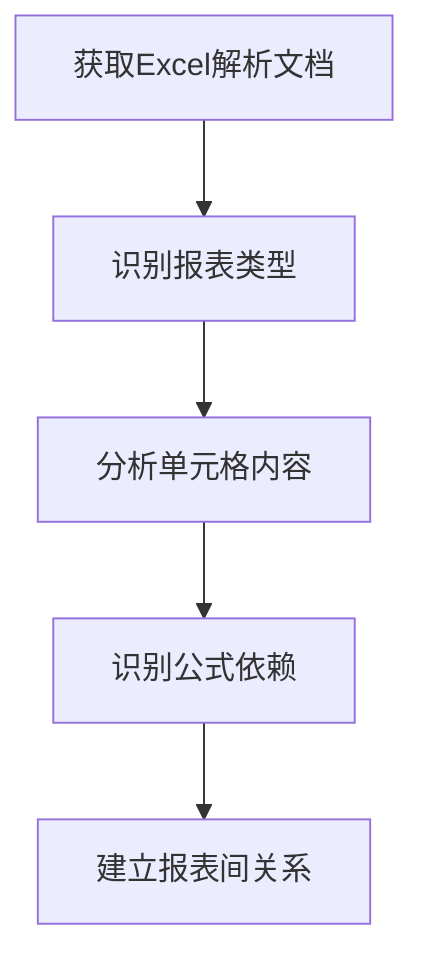

# 数据分析方法论

## 一、数据映射分析方法

### 1.1 核心原则

| 原则 | 说明 |
|------|------|
| **准确性** | 确保映射关系的正确性 |
| **完整性** | 覆盖所有关键数据项 |
| **可追溯性** | 建立完整的数据血缘 |
| **可验证性** | 映射关系可通过数据验证 |

### 1.2 分析步骤

#### 第一步：理解业务目标
- 明确分析的目的和产出要求
- 确定关键业务指标
- 理解报表的业务含义

#### 第二步：收集原始资料
- Excel报表模板
- 数据库表结构定义
- 样本数据
- 业务说明文档

#### 第三步：报表结构分析


#### 第四步：数据库表分析
- 梳理表结构
- 理解字段含义
- 分析表间关联关系
- 识别关键字段

#### 第五步：建立映射关系
- **直接映射**：字段名称一致或含义相同
- **计算映射**：通过公式计算得出
- **关联映射**：需要多表关联获取
- **转换映射**：需要数据格式转换

#### 第六步：验证与确认
- 抽样验证
- 逻辑检查
- 业务规则确认

### 1.3 映射类型分类

| 映射类型 | 描述 | 示例 |
|---------|------|------|
| **直接映射** | Excel单元格直接对应数据库字段 | 工程名称 → project_name |
| **计算映射** | 通过公式计算得到 | 成本刚性度 = 刚性成本/总成本 |
| **聚合映射** | 需要聚合函数计算 | 月度合计 = SUM(明细) |
| **关联映射** | 需要多表关联 | 通过项目ID关联获取部门信息 |
| **常量映射** | 固定值或枚举值 | 报表类型 = "月度预算" |

---

## 二、数据血缘分析方法

### 2.1 血缘分析的价值
- **追溯数据来源**：明确数据从哪里来
- **理解转换过程**：了解数据经过哪些处理
- **定位影响范围**：变更时评估影响
- **数据质量追踪**：定位问题数据来源

### 2.2 血缘分析步骤

#### 步骤1：识别数据节点
- 数据源节点（数据库表）
- 处理节点（ETL、计算）
- 输出节点（报表、指标）

#### 步骤2：绘制血缘图


#### 步骤3：记录转换规则
- 字段级别的转换逻辑
- 计算规则和公式
- 数据过滤条件

### 2.3 血缘文档内容
- 数据来源说明
- 转换规则描述
- 依赖关系图
- 变更影响分析

---

## 三、业务指标分析方法

### 3.1 指标定义分析
- **指标名称**：明确指标的业务名称
- **统计口径**：确定计算的范围和边界
- **计算公式**：明确具体的计算方法
- **数据来源**：确定数据来自哪些表/字段

### 3.2 指标分类框架

| 维度 | 指标类型 | 示例 |
|------|---------|------|
| **财务维度** | 成本、利润、收入 | 项目毛利率、成本占比 |
| **运营维度** | 进度、质量、安全 | 工期完成率、验收通过率 |
| **资金维度** | 回款、确权、现金流 | 应收款回收率、确权率 |
| **效率维度** | 资源利用、周转 | 材料损耗率、设备利用率 |

### 3.3 指标关系分析
- **因果关系**：指标间的驱动与被驱动关系
- **相关关系**：指标间的相关性分析
- **层级关系**：汇总指标与明细指标的关系

---

## 四、问题排查与解决方法

### 4.1 常见问题类型

| 问题类型 | 表现 | 排查方法 |
|---------|------|---------|
| **数据缺失** | 报表单元格为空 | 检查数据源是否有数据 |
| **数据错误** | 数值明显不合理 | 核对计算公式和数据源 |
| **映射错误** | 字段对应关系错误 | 重新核对业务含义 |
| **计算错误** | 公式逻辑错误 | 验证公式计算过程 |
| **格式错误** | 数据类型不匹配 | 检查数据转换规则 |

### 4.2 问题解决流程
```
发现问题 → 定位原因 → 分析影响 → 制定方案 → 实施修复 → 验证结果
```

### 4.3 问题记录模板
| 问题编号 | 问题描述 | 影响范围 | 根因分析 | 解决方案 | 责任人 | 状态 |
|---------|---------|---------|---------|---------|-------|------|
| 唯一标识 | 清晰描述问题 | 受影响的报表/指标 | 根本原因分析 | 具体解决措施 | 负责人 | 待处理/处理中/已解决 |

---

## 五、跨行业适配指南

### 5.1 行业差异点

| 行业 | 核心指标差异 | 数据特点 |
|------|-------------|---------|
| **房建行业** | 确权率、成本刚性度、回款率 | 项目周期长、数据量大 |
| **制造业** | 产能利用率、良品率、库存周转率 | 生产数据实时性要求高 |
| **零售业** | 销售额、毛利率、库存周转 | 数据量大、维度多 |
| **金融行业** | 风险指标、收益率、流动性 | 合规要求高、计算复杂 |

### 5.2 通用适配步骤
1. **理解行业业务**：学习目标行业的核心业务流程
2. **识别关键指标**：确定行业特有的核心指标
3. **调整分析方法**：根据行业特点调整分析重点
4. **复用基础框架**：使用统一的文档管理和分析流程

### 5.3 注意事项
- 保持方法论的通用性
- 针对行业特点定制内容
- 持续积累行业知识

---

**版本**：V1.0  
**创建日期**：2026年6月  
**适用范围**：数据映射与分析类项目
